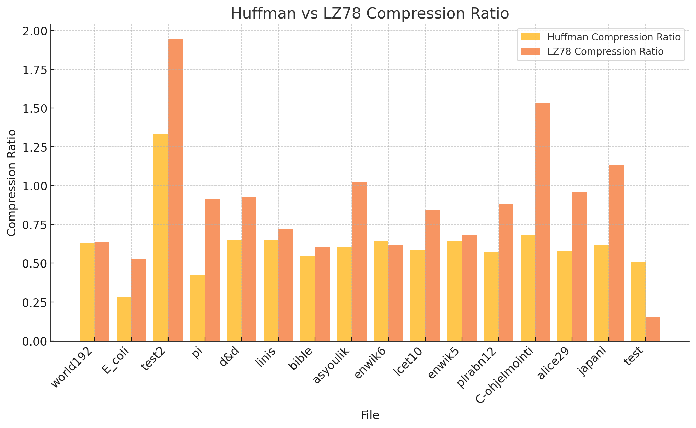

# Testausdokumentti
## Yksikkötestauksen kattavuusraportti.
### **Huffman.cpp:**
- Kaikilla funktioilla on jokaisella pari eri testiä.  
- `HuffmanTree`-luokalla on myös jokaisella metodilla testit.  
- Alussa on myös satunnaisilla syötteillä tehtävä testi, jossa testataan, että syöte on sama kuin pakkauksen ja purkamisen jälkeinen tulos.  
- Myös testit erityistapauksille pakkauksen ja purkamisen jälkeisen tuloksen vertailussa, kuten:
  - yhden merkin syöte  
  - useampi saman merkin syöte  
  - tyhjä syöte  
  - pari muuta edustavaa testiä.  

### **LZ78.cpp:**
- Kaikilla funktioilla on ainakin muutama testi.  
- On myös pari yleistä testiä, joista ensimmäisessä vertaillaan satunnaisilla syötteillä pakkauksen ja purun jälkeisiä tuloksia.  
- Testattu myös erityistapauksilla:
  - tyhjä syöte  
  - yhden merkin syöte  
- Kaikissa testeissä on mukana pari perustapausta ja rajatapaukset. 

### **utils.cpp**
- Kaikilla funktioilla on ainakin pari testiä.

### **main.cpp**
- Ei ole yksikkötestejä, koska mainissa ei oikeastaan ole funktioita testattavana.

---

## **Mitä on testattu, miten tämä tehtiin?**
Tein pitkälti testit hyödyntämällä Googlen testauskirjastoa. Kaikki testit on myös ajettu **Valgrindilla** muistivuotojen löytämiseksi.

---

## **Minkälaisilla syötteillä testaus tehtiin?**
- Yleisesti perustapaukset
- Parit rajatapaukset
- Laajemmat kokoohjelman testit satunnaisilla syötteillä.

Käytännön ohjelman testaamisessa voi käyttää vipua 'p', ja niitä testejä on ajettu kansion samples/ tiedostoilla onnistuneesti. Omalla tietokoneella minulla on myös vielä pari isompaa tekstitiedostoa, joista suurin oli kooltaan 1 GB, ja jonka pystyi ajamaan onnistuneesti vivulla p. Repon samples/ kansio sisältää erilaisia testitiedostoja, joista suurin on kooltaan noin 28 MB.

---

## **Miten testit voidaan toistaa?**
Satunnaisten merkkien testejä ei pysty toistamaan täsmälleen samana, mutta muut testit voidaan toistaa samana ajamalla testiohjelma uudestaan. Testit voi toistaa ajamalla projektin juuressa ```make test```, kunhan on Googlen test kirjasto asennettuna.

Linuxilla: ```sudo apt-get install pkg-config``` ja ```sudo apt install libgtest-dev``` jonka jälkeen voi ajaa ```make test``` tai ```make test SANITIZE=1``` joka ajaa ohjelman **Valgrindilla**. Jälkimmäinen vaatii ```sudo apt install valgrind```.

Macilla: ```brew install googletest``` jonka jälkeen voi ajaa ```make test``` tai myös parametrilla `SANITIZE=1`. 

Muuten ohjelmaa pystyy myös testaamaan ajamalla projektin juuressa ```build/main samples/ p```. Tämä ajaa koko samples/ kansion läpi

---

## **Ohjelman toiminnan empiirisen testauksen tulosten esittäminen graafisessa muodossa.**



